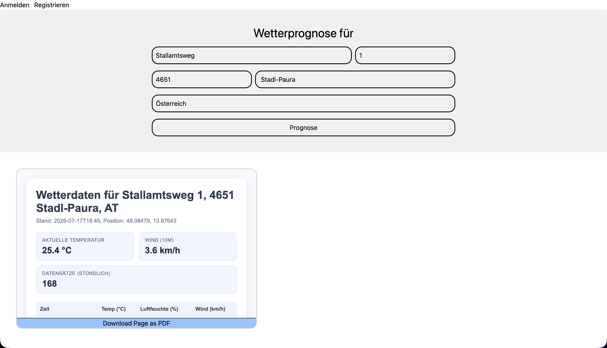

# 🌤️ Wetter HTML/PDF Service

Eine Demo Applikation zur Abfrage von Wetterprognosen basierend auf Adressen. Das System konvertiert die Wettervorhersage in HTML und optional in PDF-Dateien.




---

Dieses Projekt wurde als technische Demo erstellt, um die Integration von APIstax-Diensten in eine Quarkus-Anwendung zu veranschaulichen.

## Features

- Adresskoordinatne mithilfe der APIstax Geocoding API ermitteln
- Vorhersagedaten von Open-Meteo abrufen
- HTML-Berichte mit Qute erstellen
- HTML-Berichte mithilfe der APIstax HTML-to-PDF API in PDF-Dateien konvertieren
- Vorschau des erstellten HTML-Dokuments anzeigen
- Die erstellte PDF-Datei herunterladen
- Angular-Frontend
- Authentifizierung mit Ory Kratos prototypisieren

---

## Architektur

```
         ┌────────────┐        
         │ Ory Kratos │        
         └────────────┘        
               ▲               
Angular────────┘               
   │                           
   │                           
   │                           
   │                           
   ▼                           
Quarkus                        
   │                           
   ├─────►ApiStax Geocoding    
   │                           
   ├─────►Open-Meto Weather API
   │                           
   ├─────►Qute Templating      
   │                           
   └─────►ApiStax HTML-to-PDF  
                   │           
                   ▼           
                PDF-Report     
```

**Tech-Stack:**
- Quarkus 3.37.3 (Java 21)
- Qute
- Angular
- Ory Kratos
- Docker Compose
- Open-Meteo API
- APIstax


## Workflow
```
     Address
        ↓
  APIstax Geocoding
        ↓
   Coordinates
        ↓
    Open-Meteo
        ↓
  Weather Data
        ↓
    Qute HTML
        ↓
APIstax HTML-to-PDF
        ↓
       PDF
```

---

## Getting Started

### API-Keys beschaffen

1. **ApiStax**: https://www.apistax.io/ (kostenlos mit Limits)
   - API-Key in `backend/src/main/resources/application.properties` oder im `.env` setzen
2. **Open-Meteo**: Kostenlos, keine Authentifizierung erforderlich

### Clone repository
```bash
git clone https://github.com/raphaelabl/weather-pdf-app.git
```

### Installation und Start

#### Environments
```
cp docker-compose.example.yml docker-compose.yml

cp backend/src/main/resources/application.example.properties backend/src/main/resources/application.properties

cp frontend/src/environments/environment.example.ts frontend/src/environments/environment.ts
```

Vor dem Start müssen folgende Werte gesetzt werden:
```
KRATOS_COOKIE_SECRET=replace-with-a-long-random-value
KRATOS_CSRF_SECRET=replace-with-a-long-random-value

APISTAX_API_KEY=replace-with-your-apistax-api-key
```

#### Ory Starten
```bash
docker compose up -d
```
**Überprüfen ob alles läuft**
```
docker compose ps
```

#### Backend starten
```bash
cd backend

# Dev-Modus mit Live-Reload
./mvnw clean quarkus:dev

```

**Backend läuft auf**: `http://localhost:8080`


#### Frontend starten (neues Terminal)
```bash
cd frontend

# Dependencies installieren (nur beim ersten Mal)
npm install

# Dev-Server starten
npm start

# oder mit Angular CLI
ng serve
```

**Frontend läuft auf**: `http://localhost:4200`


## 📡 API Endpoints

### 1. HTML-Wetterprognose abrufen
**Anfrage:**
```http
GET http://localhost:8080/html?query=Mühlbachweg%2018,%204901%20Ottnang%20am%20Hausruck
```

**Parameter:**
- `query` (string, required): Adresse in beliebigem Format

**Response:**
- Status: `200 OK`
- Content-Type: `text/html`
- Body: HTML-Dokument mit Wetterdaten und Styling

**Beispiel mit cURL:**
```bash
curl -X GET "http://localhost:8080/html?query=Wien,%20Austria" \
  -H "Accept: text/html"
```

**Fehlerbehandlung:**
- Adresse nicht gefunden: HTML mit Fehlermeldung
- Wetterdaten nicht verfügbar: HTML mit Fehlermeldung

---

### 2. PDF aus HTML generieren
**Anfrage:**
```http
POST http://localhost:8080/pdf
Content-Type: text/plain

<html>
  <head><title>Wetterprognose</title></head>
  <body><h1>Wetter für Wien</h1>...</body>
</html>
```

**Request-Body:** Vollständiger HTML-String (z.B. aus `/html` Endpoint)

**Response:**
- Status: `200 OK`
- Content-Type: `application/pdf`
- Content-Disposition: `attachment; filename="document.pdf"`
- Body: Binäre PDF-Datei

**Beispiel mit cURL:**
```bash
# HTML abrufen und direkt zu PDF konvertieren
curl -X GET "http://localhost:8080/html?query=Wien" \
  | curl -X POST "http://localhost:8080/pdf" \
    -H "Content-Type: text/plain" \
    --data-binary @- \
    -o prognose.pdf
```


## Notes
Ziel war es, den grundlegenden Authentifizierungsablauf kennenzulernen. Die Implementierung dient ausschließlich Demonstrationszwecken und ist nicht für den produktiven Einsatz gedacht.
